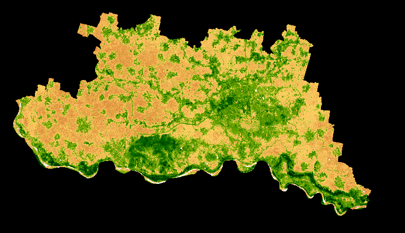

Sentinel-2 NDVI Time-Series Animation (Google Earth Engine)

This repository contains a Google Earth Engine (JavaScript) script to generate NDVI time-series GIF animations using Sentinel-2 Surface Reflectance data.

The workflow processes multi-date Sentinel-2 imagery, computes NDVI, applies day-of-year (DOY) based median compositing, and generates a time-series visualization with date labels.

---

 📍 Study Area

\- Bolpur Block, West Bengal, India

---

 🛰 Data Source

\- \Sentinel-2 Surface Reflectance (Harmonized)\

\- Collection: `COPERNICUS/S2\_SR\_HARMONIZED`

\- Spatial Resolution: 10 m

\- Temporal Coverage: 2025–2026

---

⚙️ Methodology

1\. Filter Sentinel-2 imagery by date, cloud cover, and study area.

2\. Compute NDVI using NIR (B8) and Red (B4) bands.

3\. Scale NDVI values for visualization.

4\. Group images by Day of Year (DOY).

5\. Apply median compositing to reduce cloud and noise effects.

6\. Generate a time-series GIF with date annotations.

---

📦 Output

\- NDVI time-series animation (GIF)

\- Per-date NDVI composite images

---

🧰 Platform \& Tools

\- Google Earth Engine (JavaScript API)

\- Git \& GitHub

---

👤 Author

\Akashnil Kaibartta\ 

B.Sc. (Hons) Agriculture  

Visva-Bharati University

---

📌 Notes

This script is intended for academic and research purposes. The workflow can be adapted for other regions by replacing the input boundary geometry.

---

 🖼 Sample Output

NDVI / Vegetation Cover Time-Series Animation (Bolpur Block)

